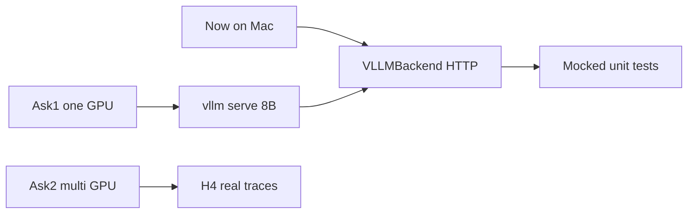
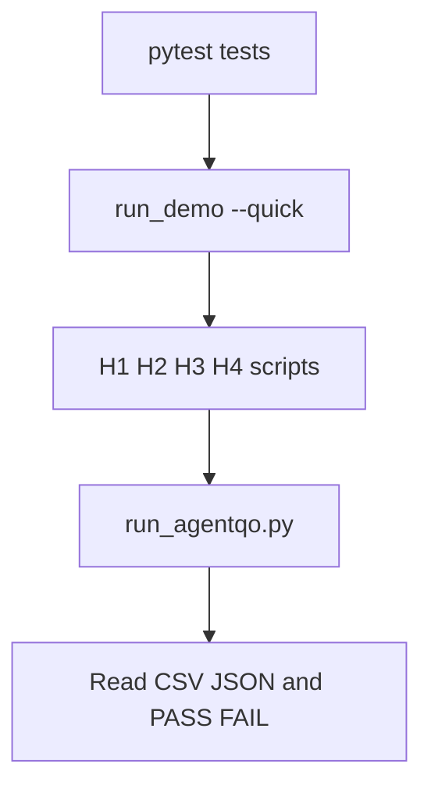
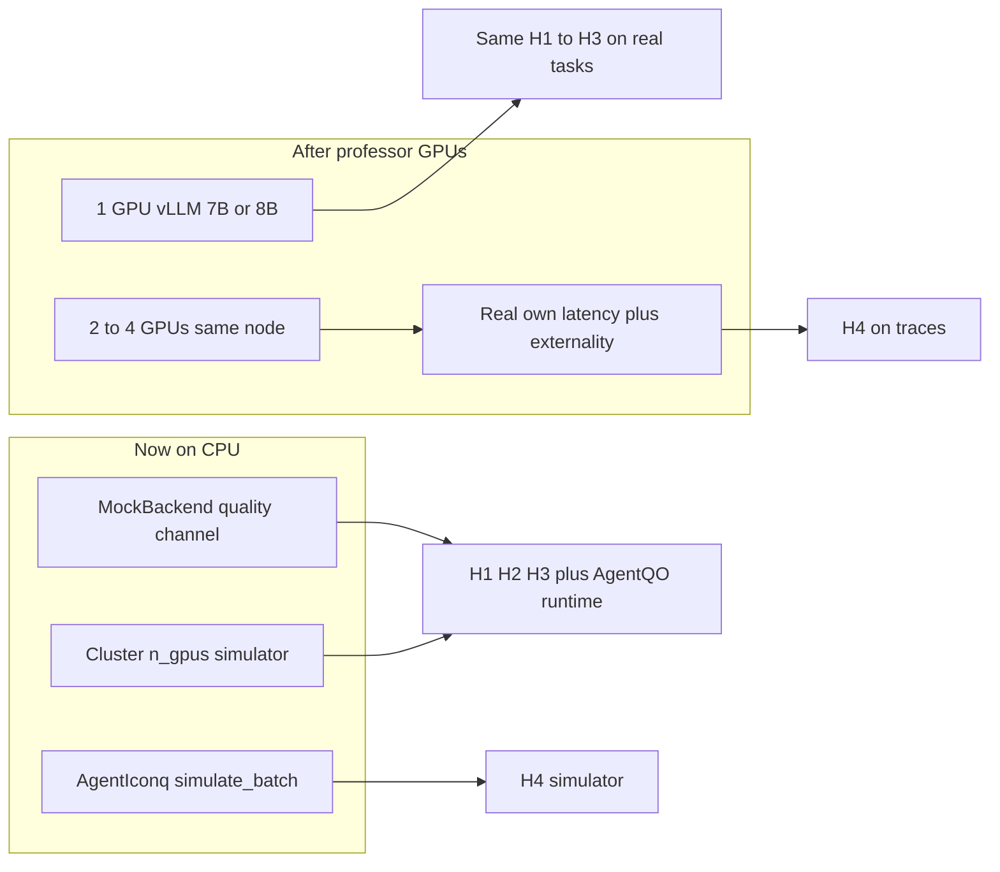

# Implement vLLM client now (before multi-GPU approval)

## Answer to your question

**Yes — implement the vLLM portion now.** You do **not** need multi-GPU approval first.

| Work | When |
|------|------|
| **VLLMBackend** HTTP client + smoke script + mocked tests | **Now** (laptop). Ready the day Ask 1 (one GPU) is approved. |
| Point AgentQO / H1–H3 at real models | After Ask 1: one GPU + `vllm serve …` |
| Real multi-GPU H4 traces / placement on physical devices | After Ask 2: 2–4 GPUs same node |

Writing the client early is safe: it talks to `http://localhost:8000/v1/...`. Without a server, tests use mocks and the smoke script exits with a clear message. No fake CUDA hook.



## What we will implement (first PR)

1. **Rewrite** [`agentqo/backends/vllm_backend.py`](agentqo/backends/vllm_backend.py)
   - Construct without requiring a live server (health check optional / lazy).
   - `execute_node`: build prompt from node role + upstream outputs + `task_context`; POST OpenAI-compatible chat/completions; measure wall time → `cost`.
   - Map `fidelity.model_id` / `fidelity.name` → model name (`small` → 8B, `large` → 70B URL or second model id when available).
   - Confidence from logprobs if present, else neutral (e.g. 0.5).
   - **Embedding:** placeholder zeros or hash-based vector of `embedding_dim` until a TRAIL-style hook exists — **do not invent** fake mid-layer activations. Document that H2 on this backend is not valid until embeddings are real.
   - `correctness`: from optional scorer in `task_context`, else `False` with metadata `correctness_unknown=True` (labeling needs a real scorer later).

2. **Smoke script** [`scripts/run_vllm_smoke.py`](scripts/run_vllm_smoke.py)
   - One tiny workflow, one node or short math DAG.
   - If connection refused → print “start vLLM with …” and exit 0/2 without crashing the suite.

3. **Tests** [`tests/test_vllm_backend.py`](tests/test_vllm_backend.py)
   - Mock `urllib`/`httpx` responses; assert `NodeResult` fields.

4. **Docs** — README note: simulator remains default; vLLM is optional when `VLLM_BASE_URL` is set.

## What we will **not** do in this PR

- Install or run vLLM on your Mac (often no NVIDIA).
- Claim H2/H4 with placeholder embeddings.
- Wire multi-GPU physical placement (Ask 2).
- Replace `MockBackend` as the default for `run_demo.py`.

## After professor green-lights Ask 1

```bash
# On the GPU box
vllm serve meta-llama/Meta-Llama-3-8B-Instruct --port 8000
# Then
VLLM_BASE_URL=http://<host>:8000 .venv/bin/python scripts/run_vllm_smoke.py
```

## After Ask 2 (later plan)

Config map `gpu_id → base_url` (one vLLM per GPU or TP across GPUs) + trace logger for own latency / imposed delay. That is separate from the client you write now.

---

# How to evaluate results and check performance

There are **two layers**. Do not mix their metrics.

1. **Measurement (H1–H4)** — does the scientific claim hold? Binary PASS/FAIL gates.
2. **Runtime (AgentQO vs baselines)** — does the joint optimizer win on quality per GPU and latency? Compare policies on the same arrivals.



## Step 0 — correctness smoke (always)

```bash
cd /Users/shusmoychowdhury/AgentQO
.venv/bin/python -m pytest tests/ -q
```

All tests must pass before trusting any figure. Runtime tests live in [`tests/test_agentqo_runtime.py`](tests/test_agentqo_runtime.py).

## Step 1 — one-shot gate report (measurement)

```bash
.venv/bin/python scripts/run_demo.py --quick
# or fuller:  .venv/bin/python scripts/run_demo.py --num-tasks 40 --num-runs 20
```

Look at the terminal PASS/FAIL table and [`data/demo/demo_results.json`](data/demo/demo_results.json) / [`data/demo/full_report.txt`](data/demo/full_report.txt).

| Gate | Pass when | Where |
|------|-----------|--------|
| **H1** | Consequence range > 0.1 and CV > 0.2; smoke test passes | `data/demo/h1/`, `h1_holds` |
| **H2** | Structure+embedding beats confidence-only; at least matches structure-only (Spearman on leave-one-workflow-out) | `data/demo/h2/`, `h2_holds` |
| **H3** | Predicted-EC allocation curve above uniform and confidence at equal cost | `data/demo/h3/`, `h3_holds` |
| **H4** | AgentIconq beats single-call and additive baselines; captures both contention (+) and prefix reuse (−) | `data/demo/h4/`, `h4_holds` |

Or run each alone:

```bash
.venv/bin/python scripts/run_h1_labeling.py --num-tasks 80
.venv/bin/python scripts/run_h2_predictor.py --num-tasks 40
.venv/bin/python scripts/run_h3_allocation.py --num-runs 30
.venv/bin/python scripts/run_h4_agenticonq.py --n-batches 500
```

Each script prints `H* HOLDS: YES/NO` and writes CSV + PNG under `data/`.

**How to read H1–H3 honestly**

- H1 failing → nothing to schedule; stop EC story.
- H2 weak Spearman (~0.2–0.3) can still PASS if it beats confidence; report the number, do not oversell.
- H3 is the allocation claim (fixed plan, predicted EC spend). It is **not** the serving optimizer.

## Step 2 — runtime optimizer performance (proposal §V)

```bash
.venv/bin/python scripts/run_agentqo.py --n-jobs 8 --n-gpus 2
# scale: --n-jobs 32 --n-gpus 4
```

Artifacts: [`data/agentqo/agentqo_runtime.csv`](data/agentqo/agentqo_runtime.csv) and `.json`.

Compare three policies on the **same** arrivals:

| Policy | Meaning |
|--------|---------|
| **FCFS-Fixed** | No edits, all-small fidelity, least-loaded GPU |
| **FixedPlan-EC** | EC upgrades fidelity / placement; graph frozen |
| **AgentQO** | Joint edits + placement + KV + speculative stop |

Columns that matter:

| Metric | Prefer | Meaning |
|--------|--------|---------|
| **Q** (`quality`) | higher | mean end-to-end task quality |
| **T** (`completion`) | lower | mean completion time |
| **Q/GPU** (`quality_per_gpu`) | **primary win** | quality per GPU-second (efficiency) |
| **makespan** | lower under load | wall-clock for the batch |
| **n_edits** | nonzero for AgentQO | did the optimizer actually edit? |

**How to judge AgentQO “wins”**

- Prefer **higher Q/GPU** and **lower T** than FCFS-Fixed at similar or better Q.
- FixedPlan-EC often has **higher raw Q** and **higher T** (it upgrades more). AgentQO can look worse on raw Q if it skips optional work; that is only a failure if Q/GPU and completion do not improve.
- Sweep `--n-gpus` (1, 2, 4) and `--n-jobs` to see contention: AgentQO’s placement edge should show more under load.

## Step 3 — what “good” looks like for a meeting

Bring one folder:

1. `data/demo/` — PASS/FAIL for H1–H4 + PNGs  
2. `data/agentqo/agentqo_runtime.csv` — AgentQO vs FCFS vs FixedPlan-EC  
3. One sentence per layer: *“EC is measurable and predictable (H1–H2); predicted-EC spend helps (H3); AgentIconq has both signs (H4); the runtime beats FCFS on Q/GPU under multi-GPU sim.”*

## What you are **not** evaluating yet (needs professor GPUs)

- Real GSM8K / HotpotQA accuracy of 7B vs 70B  
- Real vLLM p50/p99 latency under continuous batching  
- Real KV cache hit rates  

Until then, **simulator quality + simulated GPU-seconds** are the performance numbers.

## So do we need vLLM for “real numbers”?

**Depends which numbers.**

| Kind of number | Need vLLM? | Alternatives |
|----------------|------------|--------------|
| Real **task quality** (exact match, F1) | No | Ollama, HF Transformers, OpenAI/Together API — any real model + scorer |
| Real **per-call latency** of one model | No | Ollama / HF is enough for a smoke test |
| Real **multi-GPU serving** numbers AgentQO cares about (co-location, KV reuse, delay imposed on others, continuous batching) | **Yes (or equivalent)** | vLLM, SGLang, TensorRT-LLM — not Ollama |
| H1–H4 / AgentQO **as designed for the proposal** on hardware | vLLM (or equivalent) for H4 + serving; any real backend for quality | Simulator numbers are valid for method checks, not for hardware claims |

**Short answer:**  
- Simulator numbers = valid for *claims about the method* on CPU.  
- Real *quality* = any LLM.  
- Real *AgentQO systems* numbers = need a continuous-batching engine like **vLLM**, not Ollama.

---

## Can you test with Ollama now?

**Partially — for a single-model smoke test only.** Ollama does **not** replace the multi-GPU / AgentIconq / TRAIL-embedding path.

| Question | Ollama? | Why |
|----------|---------|-----|
| Run a real local LLM through AgentQO nodes? | Yes, *if* you add an `OllamaBackend` implementing `ModelBackend` | Same idea as the vLLM stub: HTTP `execute_node` → text out |
| End-to-end task quality (e.g. math answers)? | Yes, with a real scorer | Need GSM8K-style exact match; MockBackend correctness goes away |
| Recycled embeddings for H2 (TRAIL-style)? | **Usually no** | Ollama does not expose mid-layer activations; confidence from logprobs is limited |
| Multi-GPU / two-sided cost (H4, AgentQO placement)? | **No** | One (or few) sequential generates; no continuous batching, no “delay I impose on others” |
| Claim “AgentQO multi-GPU performance”? | **No** | That still needs vLLM (or similar) + same-node GPUs |

**What Ollama *is* good for on your Mac**

1. Wire `OllamaBackend` (new file, same protocol as [`ModelBackend`](agentqo/backends/base.py)): call `http://localhost:11434/api/generate` (or chat), return text + rough latency as `cost`.
2. Run one small workflow (e.g. math 2-step) with a tiny model (`llama3.2:1b` / `3b`) and measure **wall-clock per node** and **answer quality** if you add a scorer.
3. Compare fidelity choices only if you pull **two** Ollama models (e.g. 1B vs 8B) as `small` / `large` — still sequential, not multi-GPU.

**What to keep using for AgentQO “performance” today**

```bash
.venv/bin/python scripts/run_agentqo.py --n-jobs 8 --n-gpus 2   # sim multi-GPU
.venv/bin/python scripts/run_demo.py --quick                   # H1–H4 gates
```

**Bottom line:** Ollama = optional **real-text smoke test**. Simulator = the evaluation that matches the proposal. vLLM + GPUs = later hardware validation. Do not invent a fake multi-GPU story on top of Ollama.

If you want this next, say so and we can plan a minimal `OllamaBackend` + one script (no H2/H4 claims).

---

## Email to send the professor now

**Goal of this email:** report simulator progress, be honest about H3, ask for a *staged* GPU ask (not “give me a cluster”). Do **not** claim vLLM or real multi-GPU works yet.

### Suggested subject
`AgentQO update: simulator H1/H2/H4 hold; request for staged GPU access`

### Suggested body (edit names/dates)

Hi Dr. Liu,

I wanted to share a short update on the AgentQO prototype and ask about GPU access in stages.

**Where things stand (CPU simulator only)**  
I built the measurement suite and the event-driven joint logical/physical runtime from the proposal (edits + AgentIconq-style placement + KV/stopping), still on a mock backend—no real vLLM hook yet.

On a quick end-to-end demo:
- **H1 (EC varies across nodes):** holds  
- **H2 (EC predictable on leave-one-workflow-out):** holds (Spearman ~0.26; beats confidence; edges structure)  
- **H3 (spend by *predicted* EC beats confidence/uniform):** does **not** hold yet under the quick config—allocation is limited by a weak ranking signal from H2. I am treating this as a predictor-strength issue, not a crash, and will rerun with more samples and an oracle-EC upper bound.  
- **H4 (two-sided interaction cost, simulator):** holds  

Separately, the **AgentQO runtime** runs against FCFS-Fixed and FixedPlan-EC on a multi-GPU *simulator* (`n_gpus` abstract GPUs). That is not real CUDA/vLLM.

**What I am not asking for yet**  
I do not need a full multi-node cluster. The next hardware step is small and staged.

**Ask 1 (near term, after I tighten H2/H3 on CPU):**  
One GPU with enough HBM for a 7B/8B instruct model, HuggingFace access, and permission to run a long-lived **vLLM** server so I can repeat H1–H3 with real task scores (e.g. GSM8K / HotpotQA) instead of the quality channel.

**Ask 2 (after Ask 1 works):**  
2–4 GPUs **on the same machine** (not scattered nodes) so AgentIconq can measure own latency and delay imposed on co-located calls under continuous batching / shared prefixes. Cross-node is out of scope for the first check.

If helpful, I can send the `data/demo` figures and a one-page summary before we meet.

Thanks,  
Shusmoy

### What *not* to say
- Do not say AgentQO already runs on multi-GPU / vLLM.  
- Do not hide the H3 fail—frame it as “next CPU work.”  
- Do not ask for 70B + many GPUs in the first email.

### Optional one-liner if they reply “what do you need this week?”
> Nothing on GPU this week—I'm strengthening H2/H3 on the laptop. Next ask is one GPU + vLLM for a real 8B.

---

## CLI note: `--n-gpus` is not on `run_demo.py`

`scripts/run_demo.py` only runs H1–H4 measurement. It has no `--n-gpus` flag. That is why:

```text
run_demo.py: error: unrecognized arguments: --n-gpus 2
```

Use the right script:

```bash
# H1–H4 gates (no multi-GPU serving)
.venv/bin/python scripts/run_demo.py --quick

# Simulated multi-GPU AgentQO runtime
.venv/bin/python scripts/run_agentqo.py --n-jobs 8 --n-gpus 2
```

H4’s multi-GPU is inside `run_h4_agenticonq.py` / the demo’s H4 step (synthetic batches), not a CLI `--n-gpus` on the demo.

---

## Will current code run with real multi-GPU + vLLM?

**No.** Do not expect `pip install vllm` + physical GPUs to make AgentQO work today.

| Piece | Today | With real GPUs / vLLM |
|-------|--------|------------------------|
| `VLLMBackend` | Raises `NotImplementedError` on construct | Must be implemented (HTTP or in-process) |
| `--n-gpus N` / `Cluster` | **Simulated** GPUs + `simulate_batch` | Does **not** call CUDA or place tensors on device 0/1 |
| Node execution | `MockBackend` quality channel | Needs real prompts, logprobs, embeddings, scorers |
| H4 costs | Synthetic interaction model | Needs real traces (own latency + imposed delay) |
| AgentQO loop (edits, EC, placement API) | Works on CPU | Logic can stay; only backend + cost source swap |

What **does** work now: `run_agentqo.py --n-gpus 2` on CPU with MockBackend.

What **will fail** if you try hardware today: importing/constructing [`VLLMBackend`](agentqo/backends/vllm_backend.py).

---

# Do you need vLLM? How multi-GPU works

**Not a crash.** The prototype ran correctly. H3 is an honest scientific miss under this config.

| Result | Verdict |
|--------|---------|
| H1 PASS | EC really varies (range ~0.5, CV ~0.7). Safe to schedule on. |
| H2 PASS | Predictor beats confidence (Spearman 0.26 vs −0.10) and edges structure (0.19). Ranking signal is **weak but real**. |
| H3 FAIL | Predicted-EC spend does **not** beat confidence/uniform often enough (≥60% of cost levels). |
| H4 PASS | Two-sided cost model works in the simulator. |

**Why H3 fails (root cause chain)**

1. H2 Spearman ≈ 0.26 → node ranks are noisy.
2. Predicted EC on the held-out Complex workflow is almost flat (planner 0.075 … formatter 0.035). Allocation cannot pick clear winners.
3. Confidence allocation then wins more cost buckets (beats confidence only 33%; AUC Confidence 12.81 > AgentQO 12.37).
4. `--quick` uses 16 tasks / 8 runs and evaluates mainly one held-out DAG — high variance; not a paper-quality H3 trial.

**What this does *not* mean**

- It does **not** mean the runtime AgentQO (`run_agentqo.py`) is broken. H3 is fixed-plan budget allocation, not the joint serving optimizer.
- It does **not** mean H1/H2/H4 are invalid.

**What to try next (CPU, before GPUs)**

1. Full (not quick) H3: `run_h3_allocation.py --num-runs 30` with more H2 tasks.
2. Report oracle-EC allocation as upper bound (already supported) — if oracle wins and predicted loses, the bottleneck is the predictor, not the allocator.
3. Strengthen H2 (features / more workflows) before expecting H3 to pass.
4. Still run `run_agentqo.py` for the proposal §V claim; do not wait on H3.

---

# Do you need vLLM? How multi-GPU works

**No. You do not need vLLM to check AgentQO performance on CPU.** vLLM is the later hardware backend, not the current evaluator. The plan already says: simulator first, then swap the backend ([AgentQO_Prototype_Implementation_Plan.md](AgentQO_Prototype_Implementation_Plan.md) §2 and §11).

There are two different “LLM performance” questions. They need different hardware.

| What you want to check | Need vLLM / GPUs? | What you run now |
|---|---|---|
| Does EC vary, predict, and allocate well? (H1–H3) | No | `scripts/run_h1_labeling.py` … `run_h3_allocation.py` |
| Does two-sided GPU cost have both signs? (H4 methodology) | No for the method; yes later for real traces | `scripts/run_h4_agenticonq.py` |
| Does the joint optimizer edit + place + stop? | No | `scripts/run_agentqo.py --n-gpus 2` |
| Real GSM8K / HotpotQA quality of 7B vs 70B | Yes (or any real model / API) | stub: [agentqo/backends/vllm_backend.py](agentqo/backends/vllm_backend.py) |
| Real latency under shared KV / continuous batching | Yes, multi-GPU + vLLM logs | not implemented |



## How multi-GPU works today (no hardware)

The runtime already has a **logical** cluster, not CUDA:

- [`agentqo/runtime/cluster.py`](agentqo/runtime/cluster.py) — `n_gpus` GPUs, running sets `R_g`, KV regions, HBM cap
- [`agentqo/simulator/interaction_model.py`](agentqo/simulator/interaction_model.py) — same-GPU contention (positive cost) and shared `prefix_id` reuse (negative cost); **cross-GPU pairs do not interact**
- [`agentqo/workflows/dag.py`](agentqo/workflows/dag.py) — `Fidelity` is a serving choice: `llm-7b` on 1 GPU vs `llm-70b` on 2 GPUs
- AgentQO picks a GPU with `C_phys` = own latency + delay imposed on whoever is already on that GPU

So `python scripts/run_agentqo.py --n-gpus 2` (or 4) is the multi-GPU experiment **in simulation**. Changing `--n-gpus` is how you study placement. You are not launching real processes on device 0/1.

## What vLLM is for (later)

vLLM is one implementation of [`ModelBackend`](agentqo/backends/base.py). AgentQO should **not** change. Only `execute_node` changes:

- real token output instead of the quality channel
- confidence from logprobs
- recycled layer embedding (TRAIL-style) if the server exposes it
- **measured** latency / GPU-ms instead of `simulate_batch`

Do **not** invent a fake vLLM hook. Until a real server is up, keep using `MockBackend`.

An API (OpenAI / Together) can give you real *task quality* without a lab GPU. It cannot give you H4: you cannot see the other calls on the same GPU or KV reuse. For AgentIconq you need a local continuous batcher (vLLM is the right one).

## What to ask the professor (three asks, not one)

**Ask 1 — one GPU, after H1–H3 look solid on the simulator.**  
One 24–80 GB GPU, a week of time, HuggingFace access. Serve one 7B/8B with vLLM (`tensor_parallel_size=1`). Repeat H1–H3 with GSM8K / HotpotQA exact match. This is plan **Step 5**.

**Ask 2 — multi-GPU on one machine, for H4 and AgentQO serving.**  
2–4 GPUs **on the same node** (not a scattered SLURM allocation). You need two calls to share a GPU so externality is real. Ideal: enough HBM for two 7B-class models, or 7B + a tensor-parallel 70B. This is plan **Step 6**.

**Ask 3 — what you need on that box (write this in the email).**

- CUDA + vLLM, not just “a GPU node”
- permission to start a long-lived vLLM server (not one-off `srun` jobs)
- ability to log per-request start/finish while other requests are in the batch
- disk for one 8B (and later 70B if they have it)
- same-node multi-GPU; cross-node is out of scope for the first H4 paper claim

Suggested email line: *I can finish the simulator claims on CPU. For the hardware check I need (1) one GPU to rerun H1–H3 on a real 7B/8B, then (2) 2–4 GPUs on one machine so AgentIconq can measure own latency and delay imposed on co-located calls under vLLM.*

## What you should do this week (CPU)

1. Keep treating `run_h1`–`run_h4` and `run_agentqo.py --n-gpus 2` as the performance check.
2. Do **not** implement [`VLLMBackend`](agentqo/backends/vllm_backend.py) until a server URL exists.
3. When GPUs arrive: implement the real backend against the existing `ModelBackend` protocol; point H4 at **traces** (own latency, imposed delay, prefix share) instead of `simulate_batch`. Labeling, EC predictor, and the AgentQO loop stay the same.
